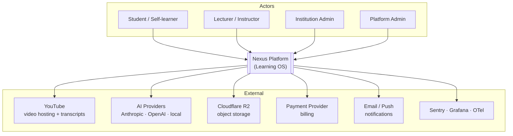
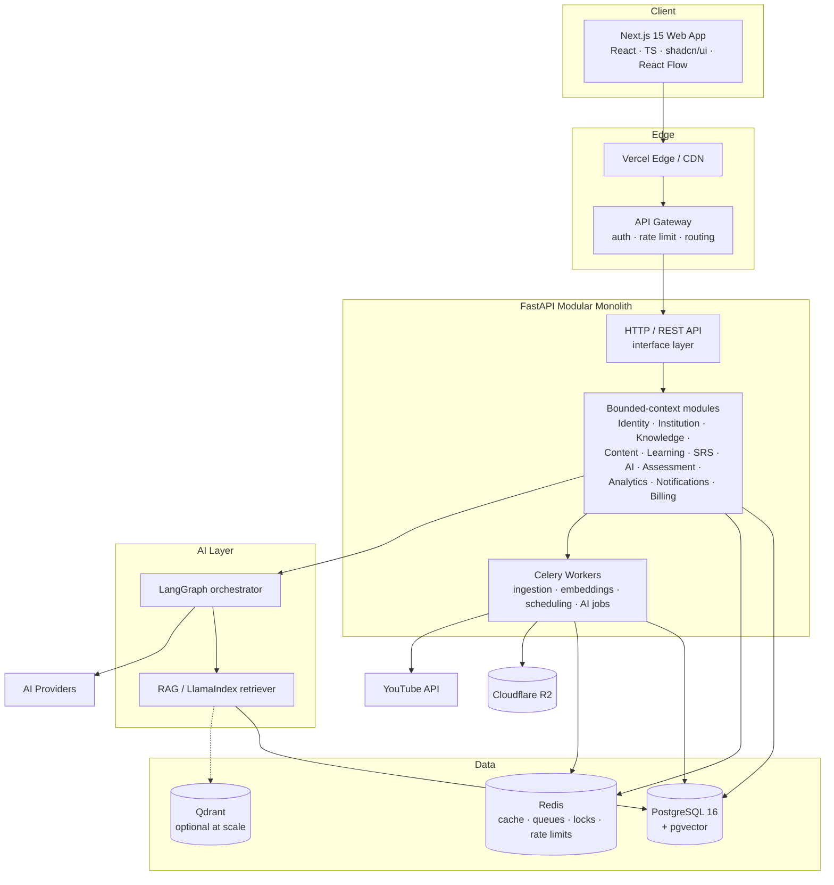

# 01 — Architecture Overview

## 1. Vision

Nexus treats knowledge as a **directed acyclic-ish graph** (mostly a DAG of
prerequisites, with cross-links) of reusable concept nodes. Institutions, programs,
courses, and degrees are *views/traversals* over this shared graph. A learner's state
is a mastery vector; the platform's job is to move that vector toward 1.0 across the
concepts that matter to the learner, in the shortest number of well-timed reviews and
lessons.

Three engines make this real:

1. **Learning Engine** — computes mastery from evidence and gates dependent concepts.
2. **Spaced-Repetition Engine** — schedules reviews (FSRS/SM-2) to fight decay.
3. **AI Tutor** — curriculum- and prerequisite-aware assistant grounded in approved
   content via RAG.

## 2. Architectural Principles

1. **Concept-centric, not course-centric.** The concept node is the atomic, reusable
   unit. Courses reference concepts; they do not own them.
2. **Mastery is evidence-derived.** Never a manual checkbox. Every mastery change
   traces to observable events (quiz, review, session, AI interaction).
3. **Modular monolith first, microservice-ready.** Ship one deployable FastAPI app
   with hard module boundaries (bounded contexts). Extract a module into its own
   service only when load or team topology demands it. This avoids premature
   distributed-systems tax while keeping the seams clean.
4. **Clean Architecture per module.** `domain → application → infrastructure →
   interface`. Dependencies point inward. The domain knows nothing about FastAPI,
   SQLAlchemy, or Redis.
5. **Event-driven between contexts.** Contexts integrate through domain events on an
   outbox → broker, never by reaching into each other's tables.
6. **CQRS at read-heavy seams.** Dashboards, analytics, search, and the mastery map
   read from denormalized projections; writes go through aggregates.
7. **Multi-tenant from line one.** Every tenant-scoped row carries `tenant_id`;
   isolation is enforced in the repository layer and Postgres RLS.
8. **AI is grounded and bounded.** The tutor answers only from approved curriculum
   content (RAG) and respects prerequisite order. Cost and abuse are budgeted.
9. **Strict typing, strict tests.** mypy/pyright + Pydantic on the backend, TS strict
   on the frontend. Domain logic is unit-tested; flows are contract/integration-tested.
10. **Observability is not optional.** Every request is traced; every engine decision
    is explainable and logged.

## 3. C4 — System Context

## 4. C4 — Container Diagram

## 5. Runtime Topology

| Tier | Component | Scaling strategy |
| --- | --- | --- |
| Edge | Vercel CDN + Next.js | Global edge, ISR/SSR, static where possible |
| Gateway | Auth + rate limit + routing | Stateless, horizontal |
| API | FastAPI (uvicorn/gunicorn) | Stateless, horizontal behind LB; HPA on CPU/RPS |
| Workers | Celery (queues: `ingest`, `embed`, `ai`, `srs`, `analytics`, `default`) | Per-queue autoscaling; priority + rate limiting |
| Cache/Queue | Redis (cluster) | Read replicas; separate instances for broker vs cache at scale |
| Primary DB | PostgreSQL 16 | Primary + read replicas; partition hot tables; PgBouncer pooling |
| Vector | pgvector in PG (default) → Qdrant (scale-out) | Start co-located; extract when vector QPS dominates |
| Object | Cloudflare R2 | Signed URLs; direct browser upload/download |

## 6. Tech Stack Rationale

- **FastAPI + SQLAlchemy 2.0 + Pydantic v2** — async-native, strongly typed, first-class
  OpenAPI. Pydantic is the DTO/validation boundary; SQLAlchemy the persistence boundary;
  domain entities stay framework-free.
- **Modular monolith** — a startup with millions-of-users *ambition* should not pay the
  distributed-systems tax on day one. Hard module boundaries + domain events preserve the
  option to extract services (AI, ingestion, analytics are the likely first extractions).
- **PostgreSQL + pgvector** — one system of record for relational data *and* embeddings
  keeps consistency simple and joins cheap. Qdrant is the documented escape hatch when
  vector QPS/recall needs dedicated infrastructure.
- **Redis + Celery** — battle-tested async processing for ingestion, embedding, AI, and
  nightly SRS/analytics jobs. Redis also backs caching, distributed locks, and rate limits.
- **LangGraph + LlamaIndex** — LangGraph gives an explicit, inspectable state machine for
  the tutor (prerequisite checks, tool calls, guardrails as nodes); LlamaIndex provides
  mature retrieval primitives over pgvector.
- **Better Auth** — modern, multi-tenant, OAuth-capable auth with a clean session model;
  the FastAPI backend independently enforces RBAC/ABAC (never trusts the client).
- **Next.js 15 + React Flow** — App Router for SSR/streaming; React Flow renders the
  knowledge/mastery graph, which is the product's signature surface.

## 7. Cross-Cutting Concerns

| Concern | Approach |
| --- | --- |
| Multi-tenancy | `tenant_id` on every scoped row + Postgres RLS + repo-level scoping |
| AuthZ | RBAC roles + ABAC policies evaluated in application layer (see doc 06) |
| Idempotency | `Idempotency-Key` on unsafe writes; dedup table in Redis/PG |
| Consistency | Transactional outbox for domain events; at-least-once + idempotent consumers |
| Caching | Redis (read-through) for graph/projections; ETags for HTTP |
| Rate limiting | Token bucket in Redis per tenant/user/route; stricter AI budgets |
| Observability | OTel traces across API→worker→AI; Prometheus metrics; Sentry errors |
| Config/secrets | 12-factor env + secret manager; no secrets in repo |
| Testing | Domain unit tests, application service tests, API contract tests, e2e smoke |
| Migrations | Alembic, forward-only, reviewed, reversible where safe |

## 8. Non-Functional Targets (initial SLOs)

- API p95 latency < 250 ms for reads, < 500 ms for writes (excluding AI streaming).
- AI tutor first-token < 2 s; full grounded answer streamed.
- Availability target 99.9% for core API.
- Review queue computation for a user < 100 ms (precomputed nightly + incremental).
- Ingestion (video → transcript → cards/quiz) is async, target < 5 min per hour of video.

See [`02-domain-model.md`](02-domain-model.md) for the bounded contexts these principles organize.
