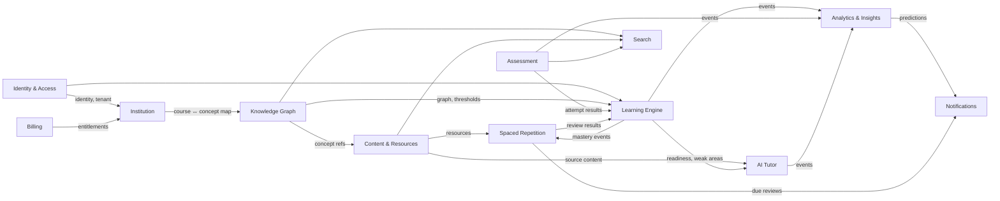
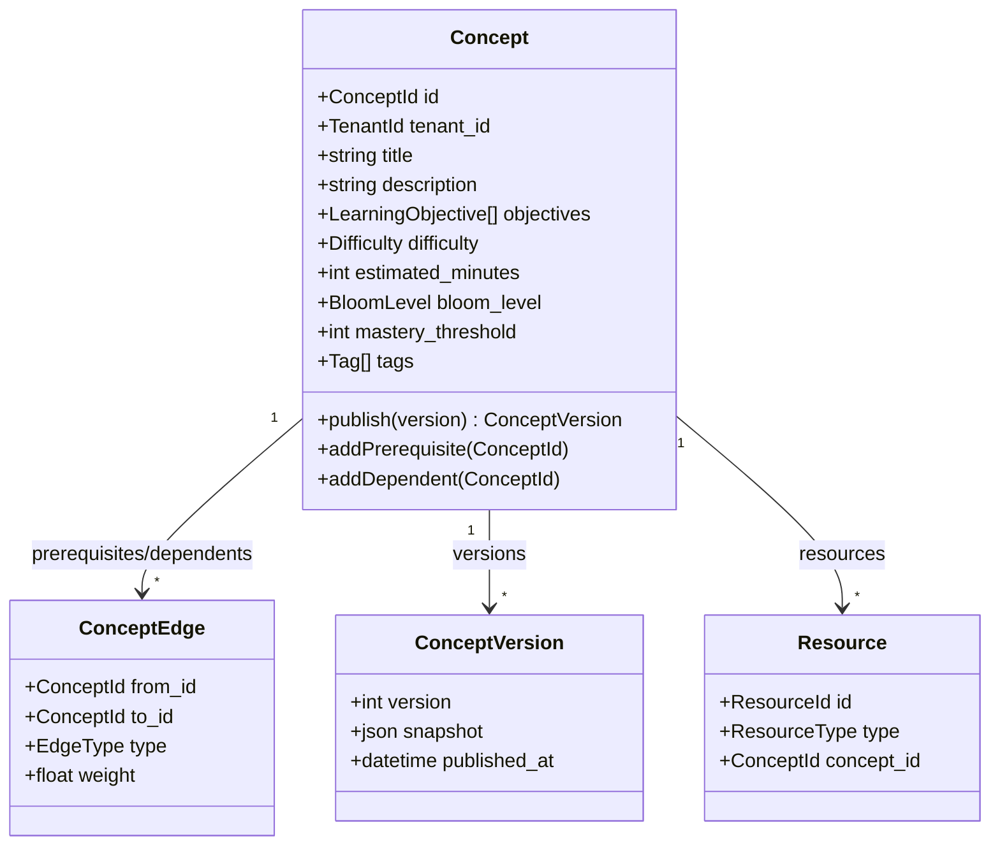

# 02 — Domain Model (DDD)

Nexus is decomposed into **bounded contexts**. Each maps to a backend module with its
own domain model, application services, and persistence. Contexts integrate only via
domain events and well-defined read APIs — never by sharing tables.

## 1. Ubiquitous Language

| Term | Meaning |
| --- | --- |
| **Concept** | Atomic, reusable unit of knowledge; a node in the knowledge graph. |
| **Edge** | Typed relationship between concepts (`prerequisite`, `related`, `part_of`). |
| **Knowledge Graph** | The global DAG of concepts and edges (tenant-scoped + shared library). |
| **Mastery** | Evidence-derived score 0–100 for a (learner, concept) pair. |
| **Mastery Threshold** | Per-concept score above which dependents unlock (default 80). |
| **Learning Path** | Ordered sequence of concepts the engine recommends next. |
| **Resource** | A learning artifact attached to a concept (note, video, PDF, example…). |
| **Card** | A spaced-repetition flashcard derived from a concept/resource. |
| **Review** | A single graded recall event on a card. |
| **Quiz / Item** | An assessment and its constituent questions. |
| **Attempt** | A learner's submission against a quiz. |
| **Session** | A study session; the container for evidence events. |
| **Course** | An institutional container that references a subgraph of concepts. |
| **Enrollment** | A learner's membership in a course/program. |
| **Tenant** | An institution or workspace; the isolation boundary. |

## 2. Context Map

**Relationship types:** IAM and Institution are *upstream* (published-language) providers.
Knowledge Graph is the *shared kernel* the learning-side contexts depend on. Analytics is a
pure *downstream conformist* consuming events. Billing is a *supporting* context guarding
entitlements/feature flags.

## 3. Bounded Contexts & Aggregates

### 3.1 Identity & Access (IAM)
- **Aggregates:** `User`, `Tenant (Organization)`, `Membership`, `Role`, `Session`.
- **Responsibilities:** authentication (via Better Auth), tenant provisioning, roles &
  permissions, session lifecycle, audit trail of security events.
- **Invariants:** a user has exactly one membership+role per tenant; a session belongs to
  one user and one tenant.

### 3.2 Institution
- **Aggregates:** `University`, `Department`, `Program`, `Level`, `Semester`, `Course`,
  `Enrollment`, `CourseConceptMap`.
- **Responsibilities:** the academic hierarchy and the mapping from courses to concept
  subgraphs. Enrollment of learners and assignment of lecturers.
- **Invariants:** a Course belongs to exactly one Department/Program; a `CourseConceptMap`
  references concepts that must exist in the Knowledge Graph (validated via KG's API/event).

### 3.3 Knowledge Graph (KG)
- **Aggregates:** `Concept`, `ConceptEdge`, `ConceptVersion`, `Tag`, `Taxonomy`.
- **Responsibilities:** the graph itself — concepts, typed edges, versions, tags,
  Bloom levels, difficulty, estimated time, mastery thresholds. Cycle prevention for
  `prerequisite` edges. Alignment to the Marble Open Taxonomy for interop.
- **Invariants:** `prerequisite` edges must not form a cycle; a concept's dependents are the
  inverse of its prerequisites; publishing a concept version is immutable.

### 3.4 Content & Resources
- **Aggregates:** `Resource` (polymorphic: note, pdf, video, example, misconception,
  reference), `VideoAsset`, `Transcript`, `MediaObject` (R2), `AiArtifact` (generated
  explanation/summary/mindmap).
- **Responsibilities:** authoring and storage of everything attached to a concept; YouTube
  embedding + watch progress; transcript/summary generation orchestration.
- **Invariants:** every resource is attached to at least one concept; media objects are
  content-addressed in R2 with signed access.

### 3.5 Assessment
- **Aggregates:** `Quiz`, `Item` (question), `ItemBank`, `Attempt`, `Response`,
  `Exam`, `PastQuestion`.
- **Responsibilities:** authoring quizzes/exams/item banks, delivering attempts, grading,
  and emitting graded results as evidence for the Learning Engine.
- **Invariants:** an Attempt is immutable once submitted; grading is deterministic and
  reproducible; items reference the concept(s) they assess.

### 3.6 Learning Engine
- **Aggregates:** `LearnerConceptState` (mastery), `StudySession`, `EvidenceEvent`,
  `LearningPath`, `Recommendation`.
- **Responsibilities:** compute mastery from evidence (quiz, review, session, AI), gate
  dependents, recommend the next best concept, predict exam readiness & failure risk,
  generate study plans. **The brain.** (See doc 07.)
- **Invariants:** mastery ∈ [0,100]; a dependent concept is `locked` until all
  prerequisites cross their thresholds; every mastery change references its evidence.

### 3.7 Spaced Repetition (SRS)
- **Aggregates:** `Card`, `CardState` (FSRS params), `ReviewLog`, `ReviewQueue`, `Deck`.
- **Responsibilities:** FSRS/SM-2 scheduling, daily due-queue construction, retention
  estimation, memory-decay modeling, auto-generation of cards from notes/videos. (See doc 08.)
- **Invariants:** a card belongs to one concept; each review updates stability/difficulty and
  computes the next due date; review logs are append-only.

### 3.8 AI Tutor
- **Aggregates:** `Conversation`, `Message`, `RetrievalContext`, `AiJob`, `Embedding`.
- **Responsibilities:** curriculum- and prerequisite-aware chat; RAG over approved content;
  generation of explanations, quizzes, flashcards, summaries, mind maps, plans; weak-area
  detection prompts. (See doc 09.)
- **Invariants:** answers are grounded in retrieved approved content; the tutor refuses to
  teach a concept whose prerequisites are unmastered without first offering the prerequisite.

### 3.9 Analytics & Insights
- **Aggregates (read models):** `EventStream`, `LearnerAnalytics`, `CohortAnalytics`,
  `Heatmap`, `Prediction`, `Achievement`.
- **Responsibilities:** ingest domain events, build projections for dashboards, compute
  streaks/heatmaps/achievements, run predictive models (readiness, churn, failure risk).
- **Invariants:** read-only conformist; never writes back into other contexts' state.

### 3.10 Notifications
- **Aggregates:** `NotificationPreference`, `Notification`, `Channel`, `DigestJob`.
- **Responsibilities:** due-review reminders, deadline/exam countdowns, streak nudges,
  achievement unlocks — email, push, in-app.

### 3.11 Billing
- **Aggregates:** `Subscription`, `Plan`, `UsageRecord`, `Invoice`, `Entitlement`,
  `FeatureFlag`.
- **Responsibilities:** plans, metered AI usage, invoices, per-tenant entitlements and
  feature flags consumed by other contexts.

### 3.12 Search (supporting)
- **Responsibilities:** universal search across concepts, courses, videos, flashcards, past
  questions, notes, quizzes, lecturers, universities — hybrid keyword (Postgres FTS) +
  semantic (pgvector) with graph-aware ranking.

## 4. Key Aggregate — `Concept` (illustrative)

## 5. Domain Events (integration contract)

| Event | Emitted by | Consumed by |
| --- | --- | --- |
| `UserRegistered`, `MembershipGranted` | IAM | Institution, Notifications, Billing |
| `CourseConceptMapUpdated` | Institution | Learning Engine, Search |
| `ConceptPublished`, `ConceptEdgeAdded` | Knowledge Graph | Learning Engine, Search, AI |
| `ResourceAdded`, `TranscriptReady` | Content | SRS (auto-cards), AI (embed), Search |
| `AttemptGraded` | Assessment | Learning Engine, Analytics |
| `ReviewLogged` | SRS | Learning Engine, Analytics |
| `MasteryChanged`, `ConceptUnlocked` | Learning Engine | SRS, AI, Notifications, Analytics |
| `StudySessionCompleted` | Learning Engine | Analytics |
| `AiInteractionCompleted` | AI Tutor | Learning Engine, Analytics, Billing |
| `PredictionUpdated` | Analytics | Notifications |
| `ReviewDue` | SRS | Notifications |
| `SubscriptionChanged` | Billing | Institution (entitlements) |

All events flow through a **transactional outbox** and are delivered at-least-once to
idempotent consumers. Event envelope: `{ event_id, type, version, tenant_id, occurred_at,
actor, payload, trace_id }`.

Next: [`03-services.md`](03-services.md).
