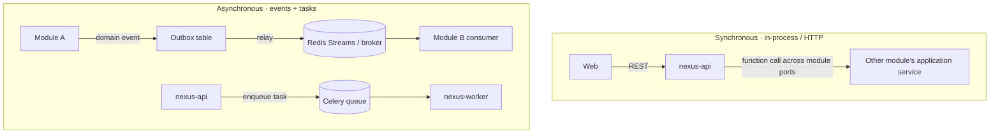

# 03 — Service & Module Catalog

Nexus ships as a **modular monolith**: one FastAPI deployable plus a Celery worker fleet.
Each bounded context is a Python package (module) with hard boundaries. This section is the
catalog of those modules-as-services, their responsibilities, communication style, and the
extraction path to standalone microservices.

## 1. Deployables

| Deployable | Contents | Scaling |
| --- | --- | --- |
| `nexus-api` | FastAPI app hosting all context modules' HTTP interfaces | Stateless, horizontal (HPA on RPS/CPU) |
| `nexus-worker` | Celery workers, one process group per queue | Per-queue autoscaling |
| `nexus-beat` | Celery beat scheduler for periodic jobs | Single leader (Redis lock) |
| `nexus-web` | Next.js 15 frontend | Vercel edge |

Same image, different entrypoints for API vs worker vs beat.

## 2. Module Catalog

| # | Module | Primary responsibilities | Reads from | Emits |
| --- | --- | --- | --- | --- |
| 1 | **identity** | Auth handshake w/ Better Auth, tenants, memberships, roles, sessions, audit | — | `UserRegistered`, `MembershipGranted`, `RoleChanged` |
| 2 | **institution** | Universities → departments → programs → levels → semesters → courses; enrollments; course↔concept map | identity, billing (entitlements) | `CourseCreated`, `EnrollmentCreated`, `CourseConceptMapUpdated` |
| 3 | **knowledge** | Concept graph CRUD, typed edges, versions, tags, taxonomy, cycle checks | — | `ConceptPublished`, `ConceptEdgeAdded`, `ConceptDeprecated` |
| 4 | **content** | Resources (notes/pdf/video/examples/misconceptions), YouTube assets, transcripts, R2 media, generated artifacts | knowledge | `ResourceAdded`, `TranscriptReady`, `MediaUploaded` |
| 5 | **assessment** | Quizzes, item banks, exams, past questions, attempts, grading | knowledge, content | `QuizPublished`, `AttemptGraded` |
| 6 | **learning** | Mastery computation, dependent gating, next-concept recommendation, study plans, readiness/failure prediction inputs | knowledge, assessment, srs, ai | `MasteryChanged`, `ConceptUnlocked`, `StudySessionCompleted`, `PathRecomputed` |
| 7 | **srs** | FSRS/SM-2 scheduling, review queue, decay, auto-card generation | content, learning | `CardCreated`, `ReviewLogged`, `ReviewDue` |
| 8 | **ai** | RAG, LangGraph tutor, generation (explain/quiz/cards/summary/mindmap/plan), embeddings | knowledge, content, learning, srs, assessment | `AiInteractionCompleted`, `ArtifactGenerated`, `EmbeddingIndexed` |
| 9 | **analytics** | Event ingestion, projections, streaks/heatmaps/achievements, predictions | all (events) | `PredictionUpdated`, `AchievementUnlocked` |
| 10 | **notifications** | Preferences, reminders, digests across email/push/in-app | srs, analytics, institution | `NotificationSent` |
| 11 | **billing** | Plans, subscriptions, metered usage, invoices, entitlements, feature flags | ai (usage), identity | `SubscriptionChanged`, `UsageRecorded` |
| 12 | **search** | Hybrid keyword + semantic + graph-ranked universal search | knowledge, content, assessment, institution | — |

Two shared kernels (not contexts): **`platform`** (config, DI container, event bus, outbox,
telemetry, base repository, error model) and **`shared_domain`** (value objects like
`TenantId`, `BloomLevel`, `Difficulty`, `MasteryScore`).

## 3. Communication Styles

**Rules of engagement**
- Cross-module *reads* go through a module's published **application service port**
  (an interface), never by importing another module's ORM models or querying its tables.
- Cross-module *writes/side-effects* go through **domain events** (async, eventually
  consistent). No synchronous write fan-out across contexts.
- Heavy/slow work (ingestion, embeddings, AI generation, nightly SRS/analytics) is always
  a **Celery task**, never inline in a request.

## 4. Celery Queues & Periodic Jobs

| Queue | Work | Priority |
| --- | --- | --- |
| `ingest` | YouTube fetch, transcript extraction, PDF parsing, chunking | normal |
| `embed` | Embedding generation + vector upsert | normal |
| `ai` | Tutor generations, quiz/card/summary generation | high (user-facing) |
| `srs` | Queue construction, decay recompute | low (nightly + incremental) |
| `analytics` | Projection updates, prediction models | low |
| `notify` | Email/push dispatch, digests | high |
| `default` | Misc | normal |

| Periodic (beat) | Cadence | Purpose |
| --- | --- | --- |
| Build daily review queues | 04:00 tenant-local | Precompute due cards |
| Recompute memory decay & retention | hourly | Keep mastery/retention fresh |
| Refresh predictions (readiness/failure/churn) | daily | Dashboards & nudges |
| Exam countdown & deadline reminders | hourly | Notifications |
| Outbox relay health / DLQ sweep | every 5 min | Reliability |
| Usage rollup for billing | daily | Metered AI |

## 5. Reliability Patterns

- **Transactional outbox** — events written in the same DB transaction as state; a relay
  publishes to the broker. Guarantees no lost events.
- **Idempotent consumers** — every consumer keyed by `event_id`; reprocessing is safe.
- **Dead-letter queues** — failed tasks/events routed to DLQ with alerting.
- **Circuit breakers** — around AI providers and YouTube; degrade gracefully (queue + retry,
  serve cached).
- **Bulkheads** — AI work isolated on its own queue/workers so a provider slowdown can't
  starve user-facing requests.
- **Idempotency keys** — client-supplied on unsafe POSTs (attempt submit, payment).

## 6. Microservice Extraction Path

Extract only when metrics justify it. Likely order:

1. **ai** — spikiest load, independent scaling, provider isolation, cost governance.
2. **ingestion/content workers** — bursty, CPU/IO heavy (transcripts, PDF, embeddings).
3. **analytics** — write-once/read-heavy, can move to its own store (columnar) later.
4. **search** — if hybrid search QPS or a dedicated engine (Qdrant/OpenSearch) demands it.

Because modules already communicate via ports + events, extraction means "put an HTTP/gRPC
adapter on the port and move the package to its own deployable" — not a rewrite.

Next: [`04-database-schema.md`](04-database-schema.md).
