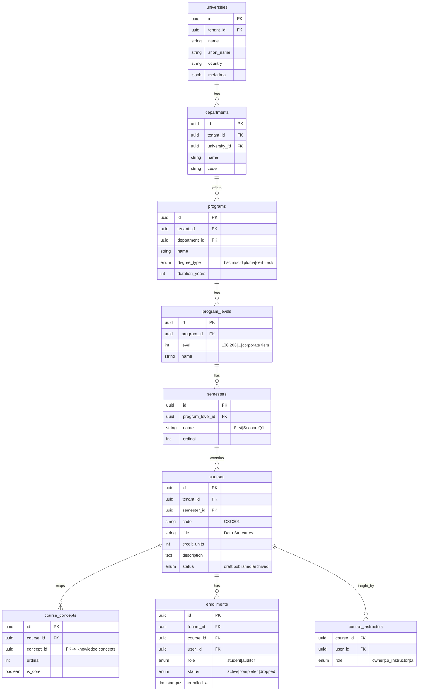
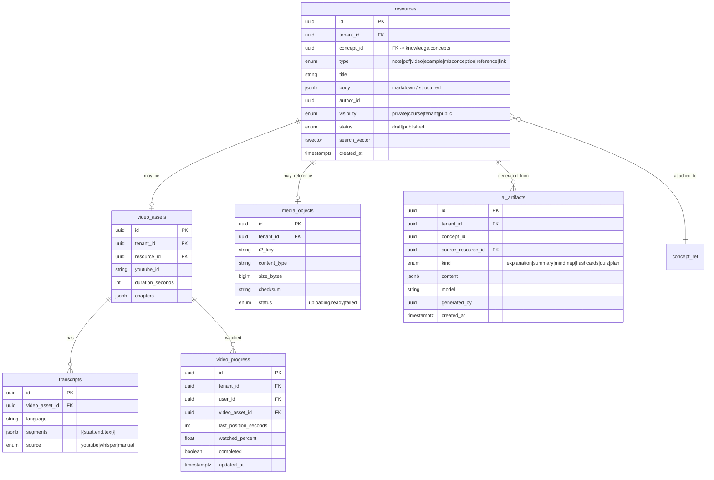
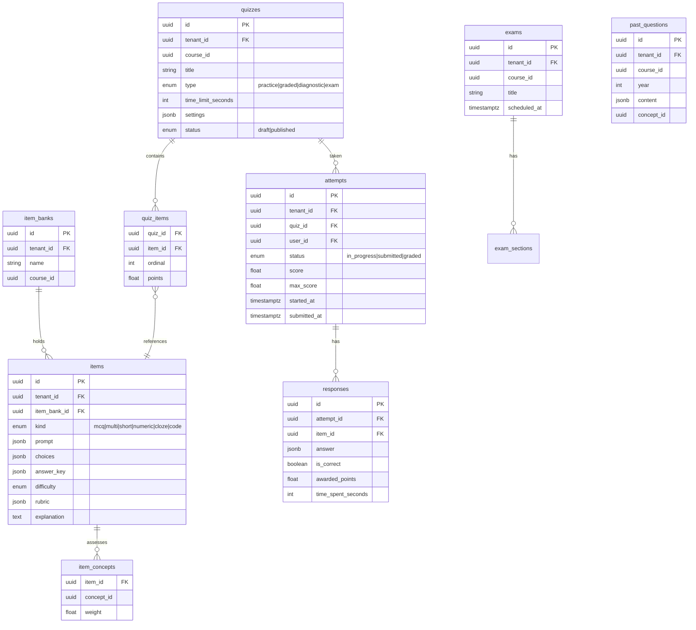
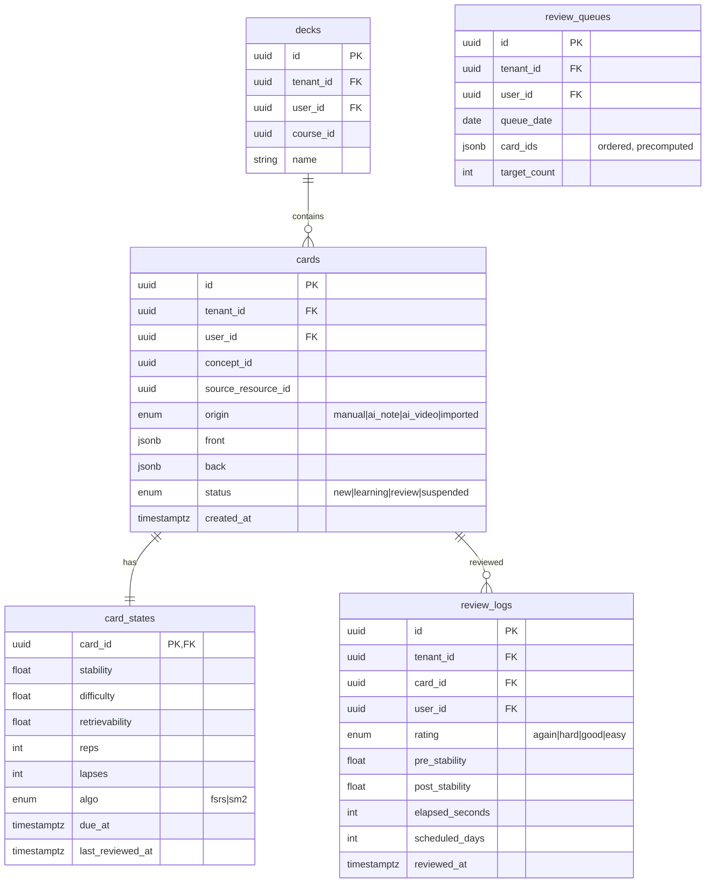
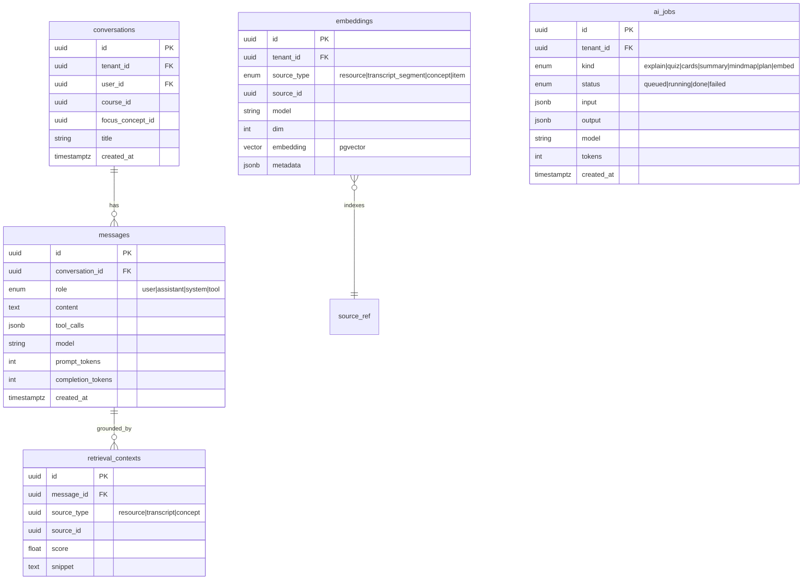
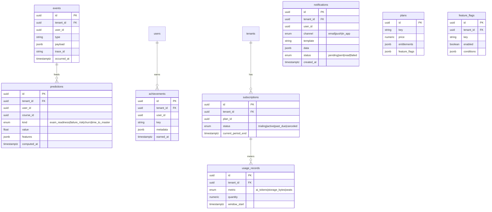

# 04 — Database Schema

PostgreSQL 16 is the system of record, with the `pgvector` extension for embeddings.
Tables are grouped by bounded context (Postgres **schemas**) to keep boundaries explicit:
`iam`, `institution`, `knowledge`, `content`, `assessment`, `learning`, `srs`, `ai`,
`analytics`, `billing`, `platform`.

## 0. Conventions

- **PK:** `id UUID PRIMARY KEY DEFAULT gen_random_uuid()` (UUIDv7 preferred for locality).
- **Tenancy:** every tenant-scoped table has `tenant_id UUID NOT NULL` + Postgres **RLS**
  policy `tenant_id = current_setting('app.tenant_id')::uuid`.
- **Audit:** `created_at`, `updated_at timestamptz NOT NULL DEFAULT now()`;
  `created_by`, `updated_by UUID`; soft delete via `deleted_at timestamptz NULL`.
- **Enums:** Postgres `ENUM` types for stable domains; lookup tables where values evolve.
- **Money:** `numeric(19,4)` + ISO currency; **time:** `timestamptz` (UTC) everywhere.
- **JSON:** `jsonb` for flexible/semi-structured payloads (objectives, snapshots, metadata).
- **Naming:** snake_case, plural tables, FK `<entity>_id`.

## 1. IAM (`iam`)

```mermaid
erDiagram
    tenants ||--o{ memberships : has
    users ||--o{ memberships : has
    tenants ||--o{ roles : defines
    roles ||--o{ role_permissions : grants
    memberships }o--|| roles : assigned
    users ||--o{ sessions : owns
    tenants ||--o{ audit_logs : records

    tenants {
        uuid id PK
        string slug UK
        string name
        enum type "university|academy|corporate|personal"
        enum status
        jsonb settings
        timestamptz created_at
    }
    users {
        uuid id PK
        string email UK
        string full_name
        string avatar_url
        string locale
        string timezone
        boolean email_verified
        timestamptz created_at
    }
    memberships {
        uuid id PK
        uuid tenant_id FK
        uuid user_id FK
        uuid role_id FK
        enum status "active|invited|suspended"
        timestamptz created_at
    }
    roles {
        uuid id PK
        uuid tenant_id FK
        string key "student|lecturer|admin|owner|custom"
        string name
        boolean is_system
    }
    permissions {
        uuid id PK
        string key UK "concept.write, course.manage, ..."
        string description
    }
    role_permissions {
        uuid role_id FK
        uuid permission_id FK
    }
    sessions {
        uuid id PK
        uuid user_id FK
        uuid tenant_id FK
        string token_hash
        string ip
        string user_agent
        timestamptz expires_at
        timestamptz revoked_at
    }
    audit_logs {
        uuid id PK
        uuid tenant_id FK
        uuid actor_id FK
        string action
        string resource_type
        uuid resource_id
        jsonb metadata
        string ip
        timestamptz created_at
    }
```



## 2. Institution (`institution`)



## 3. Knowledge Graph (`knowledge`)

```mermaid
erDiagram
    concepts ||--o{ concept_edges : from
    concepts ||--o{ concept_versions : versioned
    concepts ||--o{ concept_tags : tagged
    tags ||--o{ concept_tags : on
    taxonomies ||--o{ tags : groups

    concepts {
        uuid id PK
        uuid tenant_id FK "null = shared library"
        string title
        text description
        jsonb learning_objectives
        enum difficulty "intro|easy|medium|hard|expert"
        int estimated_minutes
        enum bloom_level "remember|understand|apply|analyze|evaluate|create"
        int mastery_threshold "default 80"
        enum status "draft|published|deprecated"
        uuid current_version_id FK
        tsvector search_vector
        timestamptz created_at
    }
    concept_edges {
        uuid id PK
        uuid tenant_id FK
        uuid from_concept_id FK
        uuid to_concept_id FK
        enum type "prerequisite|related|part_of|leads_to"
        float weight "0..1 strength"
        UK from_to_type
    }
    concept_versions {
        uuid id PK
        uuid concept_id FK
        int version
        jsonb snapshot
        uuid published_by
        timestamptz published_at
    }
    tags {
        uuid id PK
        uuid tenant_id FK
        uuid taxonomy_id FK
        string key
        string label
    }
    taxonomies {
        uuid id PK
        uuid tenant_id FK
        string name "Marble Open Taxonomy aligned"
        string external_ref
    }
    concept_tags {
        uuid concept_id FK
        uuid tag_id FK
    }
```

**Cycle prevention:** `prerequisite`/`leads_to` edges are validated against the transitive
closure before insert (recursive CTE); a materialized `concept_closure(ancestor_id,
descendant_id, depth)` table (refreshed on edge change) accelerates gating and path queries.

## 4. Content & Resources (`content`)



## 5. Assessment (`assessment`)



## 6. Learning Engine (`learning`)

```mermaid
erDiagram
    learner_concept_state }o--|| concept_ref : for
    study_sessions ||--o{ evidence_events : contains
    learning_paths ||--o{ learning_path_nodes : ordered

    learner_concept_state {
        uuid id PK
        uuid tenant_id FK
        uuid user_id FK
        uuid concept_id
        float mastery "0..100"
        float confidence "0..1"
        enum status "locked|available|in_progress|mastered"
        float retention_estimate
        int evidence_count
        timestamptz last_evidence_at
        timestamptz mastered_at
        UK user_concept
    }
    study_sessions {
        uuid id PK
        uuid tenant_id FK
        uuid user_id FK
        uuid course_id
        enum kind "study|review|quiz|ai|video"
        int duration_seconds
        timestamptz started_at
        timestamptz ended_at
    }
    evidence_events {
        uuid id PK
        uuid tenant_id FK
        uuid user_id FK
        uuid concept_id
        uuid session_id FK
        enum source "quiz|review|video|ai|reading|self_report"
        uuid source_ref_id
        float signal "normalized 0..1"
        float weight
        timestamptz occurred_at
    }
    learning_paths {
        uuid id PK
        uuid tenant_id FK
        uuid user_id FK
        uuid course_id
        enum goal "course_master|exam_ready|custom"
        timestamptz computed_at
    }
    learning_path_nodes {
        uuid id PK
        uuid path_id FK
        uuid concept_id
        int ordinal
        enum reason "weak|forgotten|next_unlock|prereq_gap"
        float priority
    }
```

`evidence_events` is **append-only** and the source of truth; `learner_concept_state` is a
derived projection updated on each event (and reconcilable by replay).

## 7. Spaced Repetition (`srs`)



## 8. AI (`ai`)



`embeddings.embedding` uses `vector(1536)` (model-dependent) with an **HNSW** index:
`CREATE INDEX ON ai.embeddings USING hnsw (embedding vector_cosine_ops)`. Partitioned by
`tenant_id` at scale; Qdrant is the escape hatch when vector QPS dominates.

## 9. Analytics (`analytics`), Notifications, Billing (`billing`)



`analytics.events` and `learning.evidence_events` are **time-partitioned** (monthly) with a
BRIN index on `occurred_at`; cold partitions are compressed/archived.

## 10. Indexing & Performance Summary

| Concern | Strategy |
| --- | --- |
| Tenant isolation | RLS on every scoped table; composite indexes lead with `tenant_id` |
| Graph traversal | `concept_closure` materialized table; recursive CTE fallback |
| Mastery lookups | Unique `(user_id, concept_id)` on `learner_concept_state`; covering index for status |
| Review queue | `(user_id, due_at)` partial index `WHERE status IN ('review','learning')` |
| Search | `tsvector` GIN indexes + pgvector HNSW; hybrid rank in `search` module |
| Hot append tables | Monthly partitions + BRIN on `events`, `evidence_events`, `review_logs` |
| Connection scale | PgBouncer (transaction pooling); read replicas for analytics/search |
| Large media | Never in DB — R2 with `media_objects` metadata + signed URLs |

## 11. Migrations

Alembic, forward-only, one migration per PR, reviewed. Destructive changes are two-phase
(expand → migrate data → contract). Every migration is tested against a seeded database in CI.

Next: [`05-api-design.md`](05-api-design.md).
