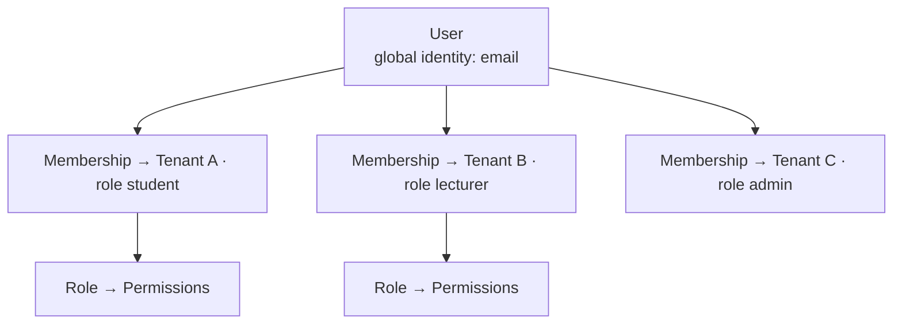
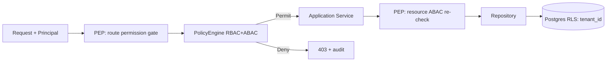

# 06 — Authentication & Authorization

## 1. Goals

- Multi-tenant identity where one human (email) can belong to many tenants with different
  roles (student at University A, lecturer at Academy B).
- Delegate the auth *handshake* (password, OAuth, sessions, verification) to **Better Auth**.
- Enforce **authorization independently on the backend** — the API never trusts the client.
- Least privilege, full auditability, defense in depth.

## 2. Identity Model



- **User** is global (one email = one user). **Membership** binds a user to a tenant with a
  **Role**. A **Session** is scoped to (user, tenant) — switching tenants issues a new
  active tenant context.

## 3. Authentication Flow (Better Auth)

```mermaid
sequenceDiagram
    participant B as Browser (Next.js)
    participant BA as Better Auth
    participant API as FastAPI
    participant DB as Postgres

    B->>BA: login (email+password | OAuth provider)
    BA->>DB: verify credentials / upsert user
    BA-->>B: session cookie (httpOnly, secure, SameSite=Lax) + session token
    B->>API: request + Authorization: Bearer <token> (+ X-Tenant-Id)
    API->>BA: validate session (introspect / verify signature)
    BA-->>API: {user_id, email, verified}
    API->>DB: load membership(user_id, tenant_id) → role + permissions
    API->>API: set RLS app.tenant_id; build principal
    API-->>B: response
```

- **Sessions:** server-side session records (`iam.sessions`) with rotating tokens; short
  access lifetime + refresh; `revoked_at` for instant logout/kill. Tokens stored **hashed**.
- **OAuth:** Google/Microsoft/institutional SSO (SAML/OIDC) via Better Auth providers;
  institutional email domains can auto-map to a tenant.
- **MFA:** TOTP/WebAuthn for admin & lecturer roles (configurable per tenant).
- **Verification & recovery:** email verification, password reset, device/session list.

## 4. Authorization — RBAC + ABAC

**RBAC** provides coarse roles; **ABAC** policies refine with resource/context attributes.

### System roles
| Role | Scope | Representative permissions |
| --- | --- | --- |
| `owner` | tenant | everything incl. billing, delete tenant |
| `admin` | tenant | manage users/courses/feature flags, view all analytics |
| `lecturer` | courses they own/co-teach | author concepts/resources/quizzes, view course analytics, generate AI |
| `ta` | assigned courses | grade, moderate, limited authoring |
| `student` | enrolled courses | learn, review, attempt quizzes, use AI tutor, view own analytics |
| `auditor` | enrolled courses | read-only learning, no graded attempts |
| `platform_admin` | cross-tenant (Nexus staff) | operational admin, support, never sees content without break-glass audit |

Roles are stored per tenant (`iam.roles`) so tenants can define **custom roles** by composing
`permissions`.

### Permission catalog (examples)
`concept.read` · `concept.write` · `concept.publish` · `edge.write` · `course.manage` ·
`resource.write` · `quiz.author` · `quiz.grade` · `attempt.take` · `ai.use` ·
`ai.generate` · `analytics.course.read` · `analytics.tenant.read` · `member.manage` ·
`role.manage` · `billing.manage` · `feature_flag.manage` · `audit.read`.

### ABAC policy examples
```
allow quiz.grade      if principal.role in {lecturer,ta} AND resource.course_id in principal.taught_courses
allow analytics.course.read if principal owns course OR principal.role == admin
allow concept.write   if principal.tenant_id == resource.tenant_id AND has(concept.write)
deny  ai.use          if tenant.entitlement.ai == false OR usage.ai_tokens > plan.cap
allow attempt.take    if principal enrolled in resource.course_id AND concept prerequisites satisfied
```

Policies are evaluated by a central **PolicyEngine** in the application layer. Decision:
`Permit | Deny` with reason (logged). Enforcement points:
1. **Interface layer** — FastAPI dependency checks the required permission before the handler.
2. **Application layer** — services re-check resource-scoped ABAC (defense in depth).
3. **Database layer** — Postgres **RLS** guarantees no row escapes tenant scope even on a bug.



## 5. Multi-Tenant Isolation

- Every scoped query runs with `SET LOCAL app.tenant_id = :tid` inside the request/session
  transaction; RLS policies filter on it.
- Repositories inject `tenant_id` on all reads/writes; a lint/test forbids raw tenant-less
  queries on scoped tables.
- Object storage keys are prefixed by tenant; signed URLs are short-lived and scoped.
- Cross-tenant access is possible only for `platform_admin` via an explicit **break-glass**
  path that forces an audit entry and (optionally) tenant consent.

## 6. Token & Session Security

- Cookies `httpOnly`, `Secure`, `SameSite=Lax`; CSRF token for cookie-based mutations.
- Access tokens short-lived; refresh rotates and detects reuse (revoke family on anomaly).
- Session binding to device fingerprint + IP change detection → step-up MFA.
- All secrets in a secret manager; signing keys rotated; JWKS if JWT introspection is used.

## 7. Auditing

Every security-relevant action (login, role change, permission grant, break-glass, billing
change, bulk export) writes to `iam.audit_logs` with actor, resource, before/after, IP, and
trace id. Audit logs are append-only and exportable per tenant.

## 8. Abuse & Rate Controls

- Per-user/per-tenant rate limits (Redis token bucket); stricter buckets for `ai.*`.
- AI usage metered against plan entitlements (`billing`); soft-warn then hard-cap.
- Bot/scraper protection on auth endpoints (throttle + CAPTCHA on anomaly).

Next: [`07-learning-engine.md`](07-learning-engine.md).
