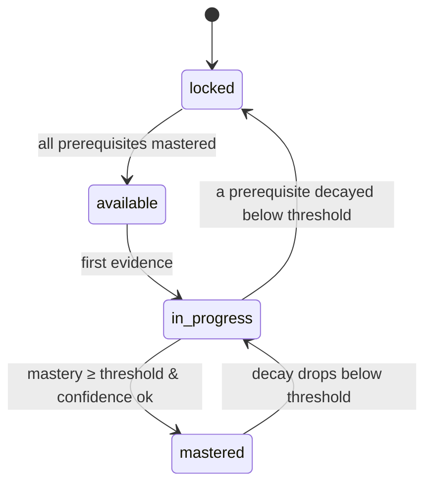
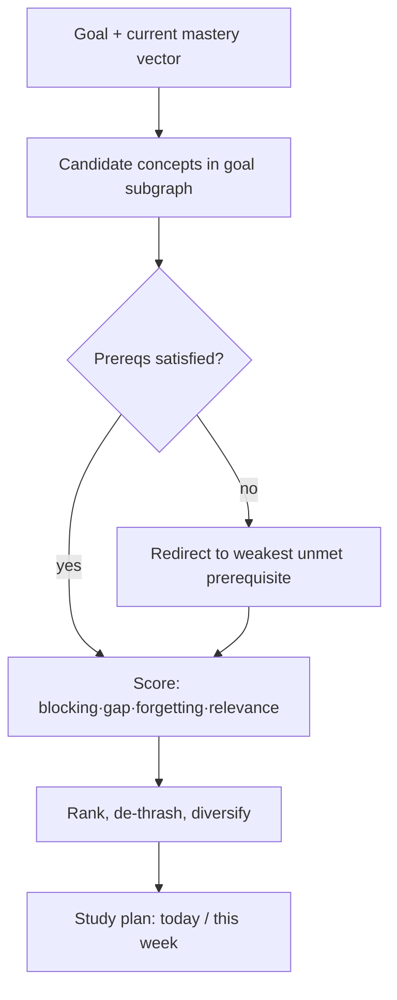

# 07 — Learning Engine

The Learning Engine is the brain. It converts raw evidence into **mastery**, gates
dependent concepts, and continuously answers: *what should this learner do next?*

## 1. Mastery Model

For each `(learner, concept)` we maintain a `learner_concept_state`: a mastery score
`0–100`, a confidence `0–1`, a retention estimate, and a status
(`locked → available → in_progress → mastered`).

### 1.1 Evidence signals
Every observable learning act is an append-only `evidence_event` with a normalized
`signal ∈ [0,1]` and a `weight`:

| Source | Signal derivation | Base weight |
| --- | --- | --- |
| Quiz/exam item (`quiz`) | correctness × difficulty-adjustment; partial credit for rubric items | 1.0 |
| Flashcard review (`review`) | rating mapped: again 0.0 / hard 0.5 / good 0.85 / easy 1.0 | 0.7 |
| Video watched (`video`) | watched% × engagement (pauses, replays) | 0.25 |
| Reading note (`reading`) | dwell-time capped, low signal | 0.15 |
| AI tutor interaction (`ai`) | comprehension check answered correctly within chat | 0.4 |
| Self-report (`self_report`) | learner-declared confidence | 0.1 |

Weights are configurable per tenant/course; they encode *how much we trust each signal*.

### 1.2 Mastery update (Bayesian Knowledge Tracing + decay)
We model mastery as latent knowledge `p(know)` updated per evidence event with a **BKT-style**
posterior, then map to 0–100. Parameters per concept: `p_learn` (transit), `p_slip`,
`p_guess`, plus a `p_forget` decay applied over time.

```
# On evidence e with signal s, weight w, at time t:
p_prior     = decay(state.p_know, elapsed_since_last_evidence)   # forgetting
p_obs_known = 1 - p_slip*(1-s) - ...          # likelihood the act came from a "known" state
p_obs_unk   = p_guess*s + ...
p_posterior = (p_prior*p_obs_known) / (p_prior*p_obs_known + (1-p_prior)*p_obs_unk)
p_know      = p_posterior + (1-p_posterior)*p_learn*w    # learning gain, scaled by trust
mastery     = round(100 * p_know)
confidence  = f(evidence_count, signal_variance)         # more/consistent evidence → higher
```

**Forgetting/decay** reuses the SRS retention curve (doc 08): mastery drifts down between
reviews at a rate set by memory *stability*. So a concept unreviewed for weeks *decays* and
can drop below its threshold → resurfaced by the engine.

FSRS/BKT parameters start from sensible priors and are refined per tenant via offline fitting
on historical `review_logs`/`attempts` (nightly `analytics` job) — the engine is
**self-tuning**, not hardcoded.

## 2. Prerequisite Gating

A concept's `status`:
- `locked` — at least one `prerequisite` has `mastery < its threshold`.
- `available` — all prerequisites mastered, learner hasn't started.
- `in_progress` — evidence exists, mastery below threshold.
- `mastered` — `mastery ≥ threshold` **and** `confidence ≥ min_confidence`.



On any `MasteryChanged`, the engine walks *dependents* (via `concept_closure`) and
re-evaluates their gates, emitting `ConceptUnlocked`/`ConceptLocked` events.

## 3. Adaptive "What Next?" Engine

Given a learner and a goal (master a course, or be exam-ready by a date), rank candidate
concepts by a **priority score**:

```
priority(c) =
      w1 * blocking_power(c)         # how many desired concepts c unblocks (graph centrality)
    + w2 * (1 - mastery(c)/100)      # room to grow
    + w3 * forgetting_urgency(c)     # 1 - retention: about to be forgotten
    + w4 * goal_relevance(c)         # on the path to the goal (course core / exam scope)
    + w5 * readiness(c)              # prerequisites satisfied → learnable now (else 0)
    - w6 * recent_focus(c)          # anti-thrash: avoid over-serving the same concept
```

`blocking_power` uses the concept's descendant count / betweenness within the goal subgraph —
prioritizing prerequisites that unlock the most. Candidates with unmet prerequisites are
redirected to those prerequisites (this is what produces "review recursion before DP").

The result is `learning_path` + ordered `learning_path_nodes`, each with a `reason`
(`prereq_gap | weak | forgotten | next_unlock`) and human-readable `why`. Recomputed on
significant events and nightly.



## 4. Study Plan Generation

The engine turns priorities into a **time-boxed plan** honoring the learner's daily budget:

```
plan(day) = interleave(
   due_reviews (from SRS, capped),
   top_priority new/weak concepts (respecting estimated_minutes),
   spaced re-encounters of forgotten concepts
)  subject to daily_minutes budget and cognitive-load limits (max new concepts/day)
```

Interleaving (not blocking) is intentional — mixed practice improves retention. Reviews are
front-loaded because overdue cards have the steepest forgetting risk.

## 5. Predictions

Computed by the `analytics` module from engine state + history, surfaced through the engine's
read API:

| Prediction | Method | Use |
| --- | --- | --- |
| **Exam readiness** | coverage × mean mastery × retention over exam-scope concepts, weighted by past-paper concept frequency | dashboard gauge, nudges |
| **Failure risk** | gradient-boosted model over features: mastery trajectory, review adherence, session cadence, quiz trend | early-warning to student + lecturer |
| **Time-to-mastery** | remaining concepts × est. minutes ÷ historical velocity, adjusted for difficulty | plan feasibility vs deadline |
| **Churn risk** | engagement decay features | notifications/retention |

Predictions are explainable: each returns top contributing `features` so the UI can say
*why*.

## 6. Which Concepts to Skip

The engine can **skip** concepts a learner already demonstrably knows: a diagnostic quiz or
strong prior evidence can push mastery ≥ threshold without step-by-step study, marking the
concept `mastered` and unlocking dependents immediately (test-out). This shortens paths for
advanced learners — mastery, not seat-time.

## 7. Explainability & Auditability

Every mastery change stores the `evidence_event` that caused it; every recommendation stores
its `reason` and feature contributions. A learner (or lecturer) can always see *why* a concept
is recommended, locked, or considered weak. This is a hard product requirement, not a
nice-to-have.

## 8. Interfaces (application ports)

```
MasteryService.record_evidence(evidence) -> MasteryChange
MasteryService.get_state(user, concept) -> LearnerConceptState
GatingService.reevaluate(user, changed_concept) -> [UnlockEvent]
RecommendationService.next_best(user, goal, k) -> [Recommendation]
StudyPlanService.build(user, course, horizon, daily_minutes) -> StudyPlan
ReadinessService.predict(user, exam) -> Prediction
```

All are pure application services over the domain; persistence is behind repositories; no
FastAPI/ORM leakage into the domain.

Next: [`08-spaced-repetition.md`](08-spaced-repetition.md).
