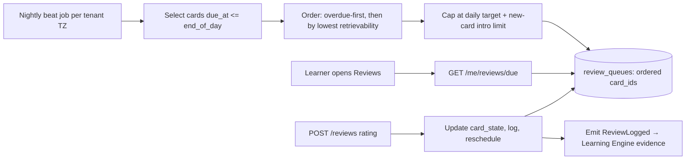

# 08 — Spaced Repetition Engine

Nexus fights the forgetting curve with a modern spaced-repetition system. The default
scheduler is **FSRS** (Free Spaced Repetition Scheduler), with **SM-2** available as a
fallback/compatibility mode. The SRS feeds the Learning Engine's decay and "forgotten
concept" signals.

## 1. Card Memory Model (FSRS)

Each card carries three memory variables plus counters:

| Variable | Meaning |
| --- | --- |
| **Stability (S)** | Days for retrievability to fall from 100% to ~90%. Grows with successful reviews. |
| **Difficulty (D)** | Intrinsic hardness (1–10). Raised by lapses, lowered by easy successes. |
| **Retrievability (R)** | Current probability of recall, `R = (1 + t/(9·S))^-1` for elapsed days `t`. |
| reps, lapses | Counters used in updates and analytics. |

### 1.1 Review update
On a review with rating `∈ {again, hard, good, easy}`:

```
t              = days since last review
R_now          = (1 + t/(9*S))^-1                 # retrievability at review time
if rating == again:                               # lapse
    D  = clamp(D + w_d_fail)
    S  = S_min + f_forget(D, S, R_now)            # stability after forgetting (usually shrinks)
    lapses += 1
    status = learning
else:                                             # successful recall
    D  = clamp(D - w_d_pass * (rating_bonus))
    S  = S * (1 + e^(w_s) * (11 - D) * S^(-w_decay) * (e^(w_r*(1-R_now)) - 1) * hard_penalty(rating))
reps += 1
interval_days  = S * (ln(target_retention) / ln(0.9))   # solve R(interval)=target_retention
due_at         = now + max(1, round(interval_days))
```

- `target_retention` is configurable (default **0.90**); higher retention → shorter
  intervals → more reviews. Exposed per deck so exam-critical decks can push higher.
- FSRS weights (`w_*`) start from published defaults and are **re-fit per user** from their
  `review_logs` by a nightly optimizer job → the schedule personalizes to each learner's
  memory.

### 1.2 SM-2 fallback
Classic SM-2 (ease factor, interval, repetition count) is retained for imported Anki decks
and as a deterministic fallback before enough data exists to fit FSRS. `card_states.algo`
records which is active; migration from SM-2→FSRS happens once ≥ N reviews accumulate.

## 2. Daily Review Queue



- **Overdue prioritization** — the most-decayed cards first (highest forgetting risk).
- **Load smoothing** — daily caps prevent review avalanches after gaps; excess spills to
  following days with priority preserved.
- **New-card throttle** — limit new introductions/day to control cognitive load.
- **Interleaving** — cards from related concepts mixed rather than blocked.
- Queue is precomputed nightly and **incrementally updated** as reviews complete during the day.

## 3. Memory Decay → Learning Engine

Retrievability `R(t)` is the bridge to mastery. The Learning Engine reads each concept's
aggregate retention (min/mean over its cards) as the `forgetting_urgency` signal. When
`R` for a mastered concept's cards drops below a floor, the engine:
1. lowers the concept's `retention_estimate`,
2. may move it out of `mastered` if decay crosses the threshold,
3. surfaces it as a **forgotten concept** for review.

This closes the loop: **remembering keeps concepts mastered; forgetting brings them back.**

## 4. Retention Forecasting

`GET /me/reviews/forecast?days=30` projects future review load by simulating `R(t)` decay and
scheduled intervals — used for the dashboard workload chart and to warn before deadlines
("you'll have 120 reviews the day before your exam — start earlier").

## 5. Automatic Card Generation

Cards are generated automatically from content (async `ai` + `srs` collaboration):

```mermaid
sequenceDiagram
    participant C as Content (note/transcript)
    participant AIJ as AI worker (generate)
    participant SRS as SRS module
    participant U as Learner (review)

    C->>AIJ: ResourceAdded / TranscriptReady
    AIJ->>AIJ: chunk → extract atomic facts/Q-A pairs (grounded in source)
    AIJ->>AIJ: dedupe vs existing cards (embedding similarity)
    AIJ-->>SRS: candidate cards {front, back, concept_id, source_ref}
    SRS->>SRS: create cards (status=new), attach to concept/deck
    U->>SRS: review; scheduler takes over
```

- Generation is **grounded** — every card cites its source resource/segment; ungrounded
  hallucinated facts are rejected.
- **Deduplication** via embedding similarity prevents near-duplicate cards.
- Cards are proposed as `new`; lecturers can review/curate before release (configurable:
  auto-publish vs review-required per tenant).
- Cloze, Q-A, and definition card types are produced depending on content shape.

## 6. Data & Interfaces

Backed by `srs.cards`, `srs.card_states`, `srs.review_logs`, `srs.review_queues`,
`srs.decks` (doc 04). `review_logs` is append-only (full history enables FSRS re-fitting and
audits).

```
SchedulerService.review(card, rating, elapsed) -> CardState        # FSRS/SM-2 update + due
QueueService.build_daily(user, date) -> ReviewQueue
QueueService.due(user, limit) -> [Card]
ForecastService.project(user, days) -> ReviewForecast
CardGenerationService.from_resource(resource) -> [CardCandidate]   # async job
OptimizerService.fit_params(user) -> FsrsWeights                    # nightly
```

Next: [`09-ai-architecture.md`](09-ai-architecture.md).
