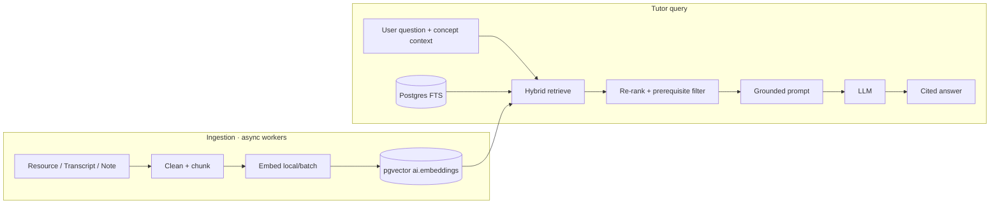
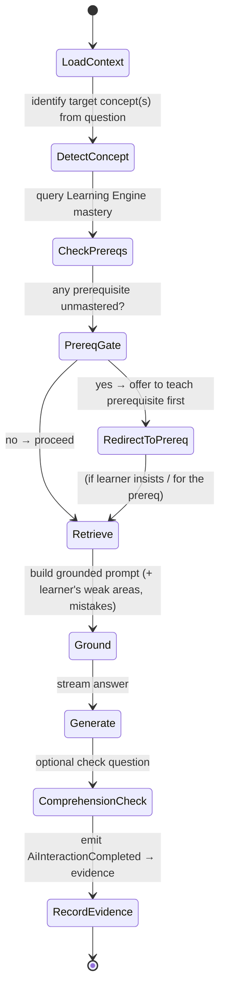

# 09 — AI Architecture

The AI layer makes Nexus a *tutor*, not a chatbot. It is **curriculum-aware**,
**prerequisite-aware**, and **grounded** — it answers only from approved curriculum content
and never teaches concepts out of order.

## 1. Provider Abstraction

All models sit behind a `LLMProvider` port so the system is model-agnostic and can route by
task, cost, latency, and availability:

```
LLMProvider.chat(messages, tools, stream) -> Stream[Delta]
LLMProvider.embed(texts) -> Vector[]
```

Adapters: **Anthropic (Claude)** as the default reasoning/tutor model, **OpenAI**, and
**local models** (vLLM/Ollama) for cheap bulk jobs (embeddings, card extraction). A router
picks per task: tutor reasoning → strongest model; summary/card extraction → cheaper; embed →
local/batch. Circuit breakers + fallbacks per provider.

## 2. Retrieval-Augmented Generation (RAG)



- **Chunking** — semantic-aware (headings, transcript segments); each chunk keeps
  `concept_id`, `resource_id`, `course_id`, `visibility`.
- **Hybrid retrieval** — dense (pgvector cosine, HNSW) + sparse (Postgres FTS), fused
  (reciprocal rank fusion), then re-ranked.
- **Scope filter** — retrieval is restricted to the tenant, the learner's course/curriculum,
  and content their role may see. **"Answer only using approved curriculum content"** is
  enforced here: if nothing relevant is retrieved, the tutor says so rather than inventing.
- **Citations** — every answer returns `retrieval_contexts` (source + snippet) surfaced in UI.

## 3. Prerequisite-Aware Tutor (LangGraph)

The tutor is an explicit **LangGraph** state machine — each guardrail and step is an
inspectable node, not hidden prompt magic.



**Context assembled per turn (curriculum awareness):** current university/department/course/
semester, current concept, completed concepts, weak concepts, recent mistakes, exam timetable
& deadlines, retrieved approved content.

**The canonical behavior** (from the brief):
> Student: "Explain Dynamic Programming."
> Tutor (sees `mastery(recursion)=42 < 80`, and recursion is a prerequisite of DP):
> "You still struggle with recursion, and Dynamic Programming builds directly on it. Let's
> solidify recursion first — here's a quick refresher and one check question…"

This is produced by the `CheckPrereqs → PrereqGate` nodes reading real mastery state, not by
prompt wishful-thinking. The gate emits a `prerequisite_gate` SSE event the UI renders.

## 4. Generation Features

All grounded in approved content, all persisted as `ai_artifacts`/`ai_jobs`:

| Feature | Input | Output |
| --- | --- | --- |
| Explain concept | concept_id + learner state | prerequisite-ordered explanation w/ citations |
| Generate quiz | concept/resource + count/difficulty | items → assessment item bank (reviewable) |
| Generate flashcards | note/transcript | grounded, deduped cards → SRS |
| Summary | video/transcript/note | structured summary + key points |
| Mind map | concept subgraph | node/edge map for React Flow |
| Practice exam | course scope + past-question distribution | timed exam blueprint |
| Study plan | learner + goal + deadline | schedule (delegates scoring to Learning Engine) |
| Weak-area detection | mastery + mistakes | narrative + targeted actions |

Long generations run as **async jobs** (`ai` queue) with status polling; interactive chat
**streams** via SSE.

## 5. Guardrails & Safety

- **Grounding guard** — post-generation check that claims are supported by retrieved context;
  unsupported answers are withheld or flagged. Reduces hallucination in an education setting
  where correctness is paramount.
- **Scope guard** — refuse/deflect out-of-curriculum or academic-integrity-violating requests
  (e.g. "do my graded exam for me") per tenant policy.
- **PII / prompt-injection** — retrieved content is treated as untrusted data, not
  instructions; system prompt isolates instructions from context; tool use is allow-listed.
- **Transparency** — answers cite sources; learner can open the source.

## 6. Cost & Abuse Governance

- **Token metering** per tenant/user → `billing.usage_records`; soft-warn then hard-cap by
  plan entitlement.
- **Caching** — semantic cache of common explanations/summaries keyed by (concept, model,
  version); prompt caching for shared system context.
- **Model routing** — cheapest capable model per task; batch embeddings on local models.
- **Rate limits** — dedicated stricter buckets for `ai.*`; AI work isolated on its own queue
  (bulkhead) so provider latency can't degrade core API.

## 7. Data & Interfaces

Backed by `ai.conversations`, `ai.messages`, `ai.retrieval_contexts`, `ai.embeddings`,
`ai.ai_jobs` (doc 04).

```
TutorService.ask(conversation, message) -> Stream[Delta]        # LangGraph, grounded
RetrievalService.search(query, scope) -> [Chunk]                # hybrid + rerank
GenerationService.explain|quiz|cards|summary|mindmap|plan(...)  -> AiArtifact  (async)
EmbeddingService.index(source) -> None                          # ingestion worker
GuardrailService.check(answer, context) -> Verdict
```

Next: [`10-sequence-diagrams.md`](10-sequence-diagrams.md).
