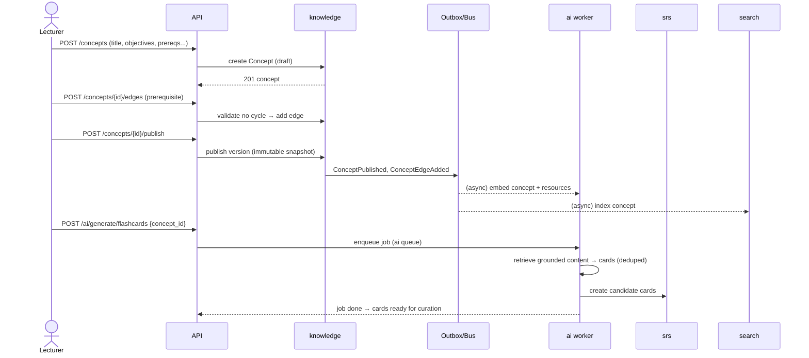
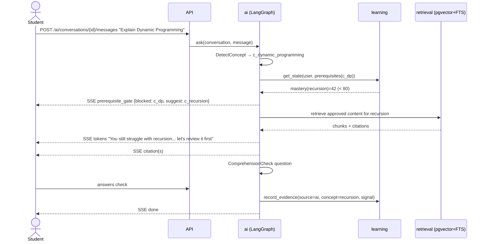
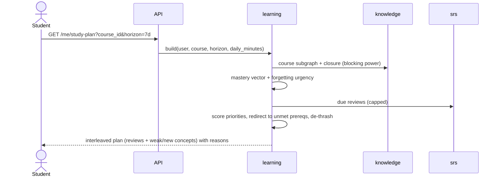

# 10 — Sequence Diagrams (Key Flows)

End-to-end flows across contexts. Each shows the synchronous request path and the async
event/task fan-out.

## 1. Lecturer publishes a concept & auto-generates learning assets



## 2. Student asks the AI tutor a question (prerequisite gate fires)



## 3. Daily review session (SRS → mastery decay loop)

```mermaid
sequenceDiagram
    participant BEAT as beat
    participant SRSW as srs worker
    participant DB as Postgres
    actor S as Student
    participant API
    participant SRS as srs
    participant LRN as learning

    BEAT->>SRSW: 04:00 build_daily_queue(tenant)
    SRSW->>DB: select due cards, order overdue-first, cap
    SRSW->>DB: write review_queues
    S->>API: GET /me/reviews/due
    API->>SRS: due(user)
    SRS-->>S: ordered cards
    loop each card
        S->>API: POST /reviews {card_id, rating}
        API->>SRS: FSRS update → new stability/difficulty/due
        SRS->>DB: append review_log, update card_state
        SRS->>LRN: ReviewLogged (evidence)
        LRN->>LRN: update mastery + retention; re-gate dependents
    end
    API-->>S: session summary + next due forecast
```

## 4. Quiz attempt → mastery update → unlock dependents

```mermaid
sequenceDiagram
    actor S as Student
    participant API
    participant ASM as assessment
    participant LRN as learning
    participant OUT as Bus
    participant NOT as notifications

    S->>API: POST /quizzes/{id}/attempts
    API->>ASM: start attempt
    loop each item
        S->>API: POST /attempts/{id}/responses
    end
    S->>API: POST /attempts/{id}/submit (Idempotency-Key)
    API->>ASM: grade attempt (deterministic)
    ASM->>OUT: AttemptGraded (per-item concept signals)
    OUT-->>LRN: evidence per concept
    LRN->>LRN: update mastery; concept crosses threshold?
    LRN->>OUT: MasteryChanged, ConceptUnlocked(c_next)
    OUT-->>NOT: notify "You unlocked Dynamic Programming"
    API-->>S: graded result + newly available concepts
```

## 5. Video ingestion → transcript → summary → cards/quiz

```mermaid
sequenceDiagram
    actor L as Lecturer
    participant API
    participant CNT as content
    participant ING as ingest worker
    participant AIW as ai worker
    participant SRS as srs

    L->>API: POST /videos {youtube_id, concept_id}
    API->>CNT: register VideoAsset
    CNT->>ING: enqueue transcript job (ingest queue)
    ING->>ING: fetch transcript (YouTube/Whisper) → segments
    ING->>CNT: store Transcript → TranscriptReady
    CNT->>AIW: enqueue embed + summary + cards + quiz
    AIW->>AIW: chunk+embed (pgvector); summary; grounded cards; quiz items
    AIW->>SRS: candidate cards (deduped)
    AIW->>CNT: ai_artifacts (summary, mindmap)
    AIW-->>API: jobs done
    L-->>API: review & publish generated assets
```

## 6. Adaptive "what next" / study plan



## 7. Sign-in with tenant resolution & authorization

```mermaid
sequenceDiagram
    actor U as User
    participant BA as Better Auth
    participant API
    participant PDP as PolicyEngine
    participant DB

    U->>BA: login (email/OAuth)
    BA-->>U: session token
    U->>API: GET /courses/{id}/analytics + Bearer + X-Tenant-Id
    API->>BA: validate session
    API->>DB: load membership+role+permissions; SET app.tenant_id (RLS)
    API->>PDP: permit(analytics.course.read, resource=course)
    PDP-->>API: Permit (owns course) | Deny+audit
    API->>DB: query (RLS-scoped)
    API-->>U: analytics
```

Next: [`11-folder-structure.md`](11-folder-structure.md).
