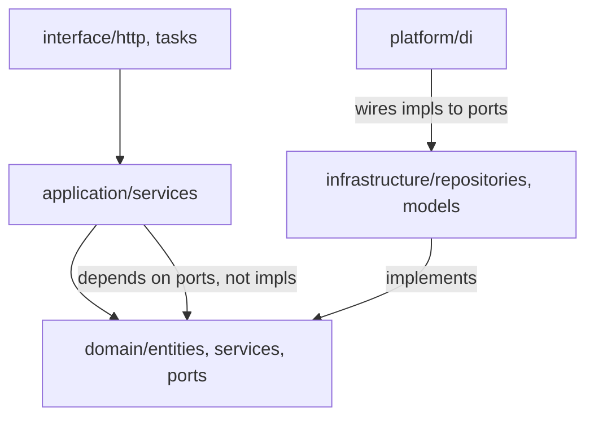

# 11 — Folder Structure

A **pnpm + Turborepo** monorepo. The backend is a modular monolith where each bounded
context is a package following **Clean Architecture**. The frontend is Next.js 15.

## 1. Top level

```
nexus/
├── apps/
│   ├── web/                    # Next.js 15 frontend
│   └── api/                    # FastAPI modular monolith (+ worker/beat entrypoints)
├── packages/                   # shared TS packages (web-side)
│   ├── ui/                     # shadcn/ui components, design system
│   ├── api-client/             # generated typed client from OpenAPI
│   ├── graph/                  # React Flow knowledge-graph components
│   └── config/                 # eslint, tsconfig, tailwind presets
├── infra/
│   ├── docker/                 # Dockerfiles, compose for local dev
│   ├── github-actions/         # reusable CI workflows
│   └── terraform/              # (later) IaC for Railway/Cloudflare/DB
├── docs/                       # this architecture set
├── turbo.json
├── pnpm-workspace.yaml
└── README.md
```

## 2. Backend — `apps/api`

```
apps/api/
├── pyproject.toml              # uv/poetry, strict mypy, ruff
├── alembic.ini
├── migrations/                 # Alembic versions (per-context)
├── src/nexus/
│   ├── main.py                 # FastAPI app factory, router mount, middleware
│   ├── worker.py               # Celery app (queues)
│   ├── beat.py                 # periodic schedule
│   │
│   ├── platform/               # SHARED KERNEL (no domain logic)
│   │   ├── config.py           # settings (pydantic-settings, 12-factor)
│   │   ├── di.py               # dependency-injection container
│   │   ├── db.py               # SQLAlchemy engine/session, RLS helpers
│   │   ├── events/             # domain event base, outbox, bus, dispatcher
│   │   ├── cqrs/               # command/query bus interfaces
│   │   ├── errors.py           # problem+json error model
│   │   ├── telemetry/          # OTel, metrics, logging
│   │   ├── security/           # principal, permission deps, policy engine
│   │   └── repository.py       # base repository (tenant-scoped)
│   │
│   ├── shared_domain/          # value objects: TenantId, MasteryScore, BloomLevel...
│   │
│   └── modules/                # ONE PACKAGE PER BOUNDED CONTEXT
│       ├── identity/
│       ├── institution/
│       ├── knowledge/
│       ├── content/
│       ├── assessment/
│       ├── learning/
│       ├── srs/
│       ├── ai/
│       ├── analytics/
│       ├── notifications/
│       ├── billing/
│       └── search/
└── tests/
    ├── unit/                   # domain + application (fast, no IO)
    ├── integration/            # repositories, DB, workers
    ├── contract/              # API contract tests vs OpenAPI
    └── e2e/                    # cross-module smoke flows
```

## 3. Clean Architecture inside a module

Every module has the same four layers; dependencies point **inward** (interface →
application → domain; infrastructure implements ports defined in domain/application).

```
modules/learning/
├── domain/                     # PURE: no FastAPI, no SQLAlchemy
│   ├── entities.py             # LearnerConceptState, StudySession, LearningPath...
│   ├── value_objects.py        # MasteryScore, Confidence, EvidenceSignal
│   ├── events.py               # MasteryChanged, ConceptUnlocked...
│   ├── services.py             # domain services (BKT update, gating rules)
│   └── ports.py                # repository & gateway interfaces (Protocols)
├── application/                # USE CASES / orchestration
│   ├── commands/               # record_evidence, end_session (writes)
│   ├── queries/                # get_mastery_map, next_best, study_plan (reads, CQRS)
│   ├── services.py             # MasteryService, RecommendationService...
│   └── dto.py                  # Pydantic DTOs (app boundary)
├── infrastructure/             # ADAPTERS
│   ├── models.py               # SQLAlchemy ORM (learning schema)
│   ├── repositories.py         # implement domain ports
│   ├── projections.py          # denormalized read models
│   └── event_handlers.py       # consume AttemptGraded, ReviewLogged
├── interface/                  # DELIVERY
│   ├── http.py                 # FastAPI router (/me/mastery, /me/next...)
│   ├── schemas.py              # request/response models
│   └── tasks.py                # Celery tasks (recompute paths, decay)
└── tests/
```

**Dependency rule illustrated:**



The domain layer imports nothing from FastAPI/SQLAlchemy/Redis. Infrastructure implements the
`Protocol` ports the domain declares; the DI container wires concrete adapters at startup.

## 4. Frontend — `apps/web`

```
apps/web/
├── app/                        # Next.js 15 App Router
│   ├── (auth)/                 # login, register (Better Auth)
│   ├── (student)/
│   │   ├── dashboard/          # streak, due, weak, countdown, heatmap, achievements
│   │   ├── graph/              # mastery map (React Flow)
│   │   ├── learn/[concept]/    # concept view: notes, video, cards, AI
│   │   ├── review/             # SRS review session
│   │   ├── tutor/              # AI chat (SSE streaming, citations)
│   │   └── search/
│   ├── (lecturer)/             # course builder, concept editor, analytics, generators
│   ├── (admin)/                # tenants, roles, feature flags, billing, audit
│   └── api/                    # route handlers / BFF where needed
├── components/                 # feature components (use packages/ui primitives)
├── lib/
│   ├── api/                    # TanStack Query hooks over api-client
│   ├── auth/                   # Better Auth client
│   └── graph/                  # React Flow adapters
├── styles/                     # Tailwind
└── tests/                      # component + Playwright e2e
```

## 5. Conventions

- **One schema per module** in Postgres; migrations namespaced per context.
- **No cross-module imports** except a module's public `application` ports and
  `shared_domain`/`platform`. Enforced by import-linter rules in CI.
- **Ports as `typing.Protocol`**; adapters registered in `platform/di`.
- **Tests colocated** per module + top-level integration/e2e suites.
- **Strict typing** — mypy strict (backend), `tsc --strict` (frontend), CI-gated.

Next: [`12-roadmap.md`](12-roadmap.md).
