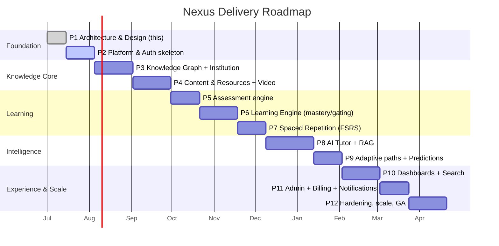

# 12 — Project Roadmap

Delivery is incremental. Each phase ends with working, tested, documented software behind
feature flags, and an explicit **Definition of Done** before the next phase begins.

## Phasing at a glance

## Phase 1 — Architecture & Design ✅ (this deliverable)
Complete architecture, domain model, DB schema, API design, auth model, engine algorithms,
diagrams, folder structure, roadmap. **No application code.** → *Awaiting approval.*

## Phase 2 — Platform & Auth Skeleton
- Monorepo scaffolding (Turborepo), Docker Compose (Postgres+pgvector, Redis), CI (lint,
  type, test), OTel/Sentry wiring.
- `platform` kernel: config, DI, DB+RLS, event/outbox bus, error model, base repository.
- `identity` module: Better Auth integration, tenants, memberships, roles/permissions,
  sessions, audit, PolicyEngine (RBAC+ABAC).
- Next.js shell with auth flows and tenant switch.
- **DoD:** a user can register, belong to a tenant with a role, and hit an authorized
  endpoint enforced at all three PEP layers; RLS proven by tests.

## Phase 3 — Knowledge Graph + Institution
- `knowledge`: concepts, typed edges, versions, tags, taxonomy, cycle prevention,
  `concept_closure`. Marble taxonomy alignment.
- `institution`: university→…→course hierarchy, enrollments, course↔concept map, bulk import.
- Graph API (`/concepts/{id}/graph`) + React Flow viewer.
- **DoD:** build the CSC301 → Data Structures → … → DP example graph via API; render it;
  cycle insert is rejected.

## Phase 4 — Content & Resources + Video
- `content`: resources (note/pdf/example/misconception/reference), R2 media, YouTube assets,
  transcripts, watch-progress, timestamp notes.
- Ingestion workers (transcript, PDF parse, chunk).
- **DoD:** attach notes/PDF/video to a concept; watch-progress persists & resumes; transcript
  generated async.

## Phase 5 — Assessment Engine
- `assessment`: item banks, quizzes, exams, past questions, attempts, deterministic grading;
  emits `AttemptGraded`.
- **DoD:** author a quiz, take an attempt, get a reproducible grade; per-item concept signals
  emitted.

## Phase 6 — Learning Engine
- `learning`: evidence pipeline, BKT+decay mastery, prerequisite gating, states, unlock
  events; mastery-map read model.
- **DoD:** quiz/review evidence moves mastery; crossing a threshold unlocks dependents;
  decay drops stale mastery; every change traceable to evidence.

## Phase 7 — Spaced Repetition
- `srs`: FSRS scheduler (+SM-2 fallback), review logs, daily queue, forecasting, per-user
  weight fitting; auto-card generation hook.
- **DoD:** review a card, get an FSRS-scheduled next date; daily queue precomputed;
  forgotten concepts feed the engine.

## Phase 8 — AI Tutor + RAG
- `ai`: provider abstraction, embeddings+pgvector, hybrid retrieval, LangGraph tutor with
  prerequisite gate, streaming + citations, generation (explain/quiz/cards/summary/mindmap),
  grounding & scope guardrails, token metering.
- **DoD:** the "explain DP → review recursion first" flow works end-to-end, grounded and
  cited; generated cards/quizzes flow into SRS/Assessment.

## Phase 9 — Adaptive Paths + Predictions
- `learning` recommendation engine (priority scoring, redirect to prereqs, de-thrash), study
  plans; `analytics` predictions (readiness, failure risk, time-to-master, churn) with
  explainability.
- **DoD:** `/me/next` and `/me/study-plan` return justified, interleaved plans; predictions
  surface top features.

## Phase 10 — Dashboards + Search
- Student dashboard (streak, due, weak, countdown, heatmap, achievements, bookmarks),
  lecturer analytics, `search` (hybrid keyword+semantic+graph-ranked universal search).
- **DoD:** dashboards render live projections; universal search returns ranked results across
  all artifact types.

## Phase 11 — Admin + Billing + Notifications
- Admin (tenants, roles, feature flags, storage, audit), `billing` (plans, metered AI usage,
  invoices, entitlements), `notifications` (reminders, digests, countdowns).
- **DoD:** entitlements gate AI/features; due-review & deadline notifications dispatch;
  admin can manage tenants and flags.

## Phase 12 — Hardening, Scale & GA
- Load testing, partitioning/read replicas, PgBouncer, cache tuning, Qdrant extraction eval,
  security review/pentest, DR/backup, runbooks, SLO dashboards (Grafana), accessibility &
  i18n pass.
- **DoD:** meets NFR SLOs (doc 01 §8) under load test; security review passed; on-call
  runbooks exist; GA.

## Cross-Cutting Tracks (continuous)
- **Testing** — unit/integration/contract/e2e per phase; coverage gates in CI.
- **Docs** — API (OpenAPI), ADRs for significant decisions, per-module READMEs.
- **Observability** — traces/metrics/alerts added with each module.
- **Security** — threat-model updates, dependency scanning, secret hygiene each phase.

## Ways of Working
Per the brief: for every phase we **explain architecture → generate code → generate tests →
generate docs → generate migrations → generate API docs → propose commit messages → wait for
approval** before proceeding.

**Immediate next step:** on approval of Phase 1, begin **Phase 2 (Platform & Auth skeleton)**.
